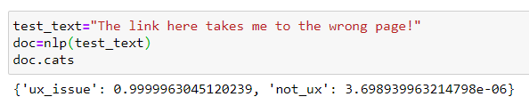
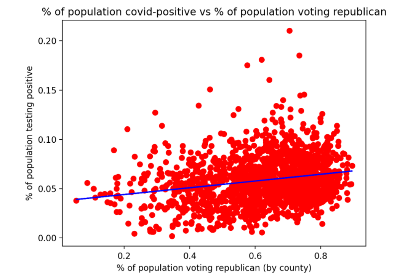
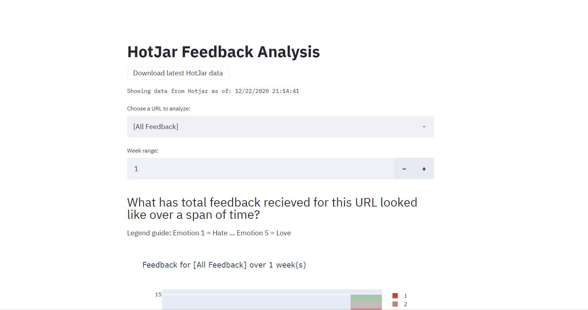

### Table of contents  
[Automating Sharepoint Tickets](#automating-sharepoint-tickets)  
[Making sense of 2020](#making-sense-of-2020)  
[HotJar Feedback App](#hotjar-feedback-app)  
[Burning man vehicle](#senior-capstone-project---burning-man-vehicle)  

---
## Automating Sharepoint Tickets
_[rsolander/sharepoint-feedback-automation](https://github.com/rsolander/sharepoint-feedback-automation) | April 2021_

Following up on the work I did to help the marketing team process website feedback (learn more [here](#hotjar-feedback-app)) - they decided to create a sharepoint list to hold ticket items for any feedback they receive across our websites that they need to follow up on. Creating these tickets manually would be an incredibly tedious task, especially when 10-20 new feedback items are coming in daily. I built an Azure-registered application to automate the process of ticket creation and distribution: the app fetches the feedback data from our third party tool and then generates new tickets in sharepoint using microsoft Graph API sharepoint calls,  executing on a set schedule daily.

Site feedback is conditionally assigned to relevant stakeholders, and I deployed a Natural Language Processing classification model with spaCy to identify UX issues based on the content of the feedback message, which then flags these issues for the user experience team. I trained the model using a large dataset of feedback collected over the span of a few months.

Built with Python and features popular libraries such as pandas, requests, and SpaCy. App is registered within Azure for secure sharepoint connection, and code runs on an Amazon Web Services EC2 instance.

---

## Making sense of 2020
_No Repo Available |  November 2020_

Can the collective mindset of a group of people be detrimental to preventing the spread of coronavirus?

I collected US county population data, US county confirmed covid case data, and US county voting data (in the 20202 election) to see if anti-mask idiosyncrasies demonstrated by a group of people results in the amplified spread of coronavirus.
While to most this may seem obvious, there are still people who doubt the effectiveness of mask-wearing and other recommended precautions, and I'm hoping that my study can help further reinforce the science behind these measures.

I represented the "groups of people" with the ~3000 counties in the united states, and I used voting results in the 2020 election as an indicator for how these counties approached coronavirus:

> "	Democrats and Democratic-leaning independents are about twice as likely as Republicans and Republican leaners to say that masks should be worn always (63% vs. 29%). Republicans are much more likely than Democrats to say that masks should rarely or never be worn (23% vs. 4%)."

_From [Pew Reasearch Center Article - Republicans, Democrats Move Even Further Apart in Coronavirus Concerns](https://www.pewresearch.org/politics/2020/06/25/republicans-democrats-move-even-further-apart-in-coronavirus-concerns/)_

Especially those supporting Trump in 2020 (and therefore voting republican) are more likely to share his dismissive attitude towards virus-reducing efforts:

> "From the moment President Trump announced recommendations from the Centers for Disease Control and Prevention to wear a face covering, he made clear that he did not personally like the idea. Early on, he made negative comments about masks and criticized people who wore them, and he has routinely refused to don one himself, even in places where mask use is required (though he did allow himself to be photographed in a mask for the first time last week, when he visited the Walter Reed National Military Medical Center). He is not alone among Republican officials in eschewing masks or downplaying their benefits, behavior that political scientists believe has encouraged a partisan split in who wears masks."

_From [NYT Article - A Detailed Map of Who Is Wearing Masks in the U.S.](https://www.nytimes.com/interactive/2020/07/17/upshot/coronavirus-face-mask-map.html)_

I don't believe that everyone who voted republican is anti-mask and anti-science, but there is significant evidence that it's an indicator for that sentiment:

> In general, Republicans are more likely to live in states with less population density, and in places that have had laxer rules about masks and lower rates of coronavirus infections, at least early in the pandemic. But research from a team that includes Shana Gadarian, an associate professor of political science at Syracuse University, has found that your political party is a better predictor of mask use than any other factor they measured. Her team compared people of the same age and living in the same ZIP code, and found partisan differences in mask behavior.

_From [NYT Article - A Detailed Map of Who Is Wearing Masks in the U.S.](https://www.nytimes.com/interactive/2020/07/17/upshot/coronavirus-face-mask-map.html)_

I created a linear regression model representating the relationship between the % of a county voting republican in 2020 and the % of that same county testing positive for coronavirus:

_Results as of 12/21/2020_

The model isn't much use for predictive means but there's a clear relationship between counties that have an overwhelming 2020-republican mindset and the amount of positive cases they have. Again, this outcome seems plausible when people are refusing to wear masks, but this is hard evidence to fight any doubts.

This data is by no means an effort to attack republicans. I want it to be an important reminder that it's important to listen to medical professionals, scientists, and researches who truly want what's best for our well-being in times like this. I hope we can reach a point where we keep politics out of the pandemic and do what's best for ourselves and those around us - these efforts can go a long way.

---

## HotJar Feedback App
_[rsolander/PyRepo](https://github.com/rsolander/PyRepo) | May 2020_

I built this app to integrate with the feedback tool installed on our externally-facing sites in an effort to collect and process feedback data and responses.
Our marketing team and website owners use the app to discover patterns in the types of feedback being recieved (good vs bad) as well as where various types of feedback are coming from (are users from certain countries having a worse / better experience than others?).
The app highlights particular pages or sites that are recieving high frequencies of bad feedback, which has often led to the team discovering UX errors faster than before.

Feedback responses over a certain period of time are included, along with information about the user submitting it (email, location, browser type).
These responses are grouped by the particular site or country page that they were submitted for, and these buckets are sent to site owners or managers that can act upon any action items identitfied through these responses.
I added code that utilizes SMTP to send these buckets in a weekly email, and I included a static web page interface for the marketing team where they can configure which emails recieve which site feedback.

Coded in Python and features popular libraries such as pandas, smtplib, and requests. Front-end is constructed using the wonderful [Streamlit.io](https://www.streamlit.io/) framework.
The app, email service, and email configuration UI are all deployed on an Amazon Web Services EC2 instance.

---

## Senior Capstone Project - Burning Man Vehicle
_No Repo Available | Jan 2018_

What better way to intersect my interests in both art and engineering than to build a rideable burning man vehicle - my senior capstone group and I chose to construct an art car out of repurposed bike parts, several machined metal and plastic components, and some very fun LED wires.

Final stage remains incomplete: attend burning man...
